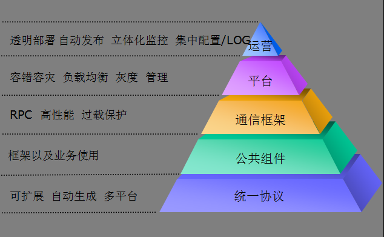
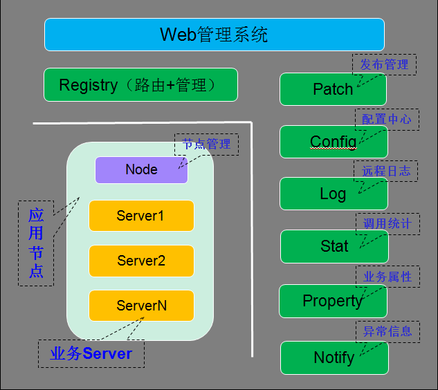

## Tars快速入门

#### 学习目标
+ Tars是什么，提供什么功能？
+ 跟其他方案的对比？
+ Tars和K8S的区别？
+ 如何使用Tars？

#### Tars介绍
+ Tars是使用Tars协议的高性能**RPC开发框架**，同时配套一体化的**服务治理平台**，帮助个人或者企业快速的以微服务的方式构建自己稳定可靠的分布式应用。
+ 框架在腾讯内部，有100多个业务、10多万台服务器上运行使用。
+ 支持**C++ 、Go**、Java等(前面两个对我影响力比较大)

#### 设计思路

+ 统一协议

  设计思路是将业务网络通信的协议进行统一，以IDL(接口定义语言)的方式，开发支持多平台、可扩展、协议代码自动生成的统一协议。

+ 公共组件、通讯框架、平台层

  + 从使用者的角度出发，封装了大量日常开发过程中经常使用的公共库代码和远程过程调用，让开发使用更简单方便；
  + 从分布式平台的角度出发，解决服务运营过程中，遇到的容错、负载均衡、容量管理、就近接入、灰度发布等问题，让平台更加强大。

+ 运营

  + 运维只需要关注日常的服务部署、发布、配置、监控、调度管理等操作。

#### 整体架构

整体架构的拓扑图主要分为2个部分：服务节点与公共框架节点。

##### 服务节点

**服务节点**可以认为是服务所实际运行的一个具体的操作系统实例，可以是物理主机或者虚拟主机、云主机。随着服务的种类扩展和规模扩大，服务节点可能成千上万甚至数以十万计。 每台服务节点上均有一个Node服务节点和N(N>=0)个**业务服务节点**，Node服务节点会对业务服务节点进行统一管理，提供启停、发布、监控等功能，同时接收业务服务节点上报过来的心跳。

##### 公共框架节点

细分为如下几个部分

+ Web管理系统：在Web上可以看到服务运行的各种实时数据情况，以及对服务进行发布、启停、部署等操作；

+ Registry（路由+管理服务）：提供服务节点的地址查询、发布、启停、管理等操作，以及对服务上报心跳的管理，通过它实现服务的注册与发现；

+ Patch（发布管理）：提供服务的发布功能；

+ Config（配置中心）：提供服务配置文件的统一管理功能；

+ Log（远程日志）：提供服务打日志到远程的功能；

+ Stat（调用统计）：统计业务服务上报的各种调用信息，比如总流量、平均耗时、超时率等，以便对服务出现异常时进行告警；

+ Property（业务属性）：统计业务自定义上报的属性信息，比如内存使用大小、队列大小、cache命中率等，以便对服务出现异常时进行告警；

+ Notify（异常信息）：统计业务上报的各种异常信息，比如服务状态变更信息、访问db失败信息等，以便对服务出现异常时进行告警；

注：很多都是功能跟k8s类似

#### 参考资料

+ [《官方文档》](https://doc.tarsyun.com/adminer/start/index.html#/tarsdoc/base/tars-intro.md)